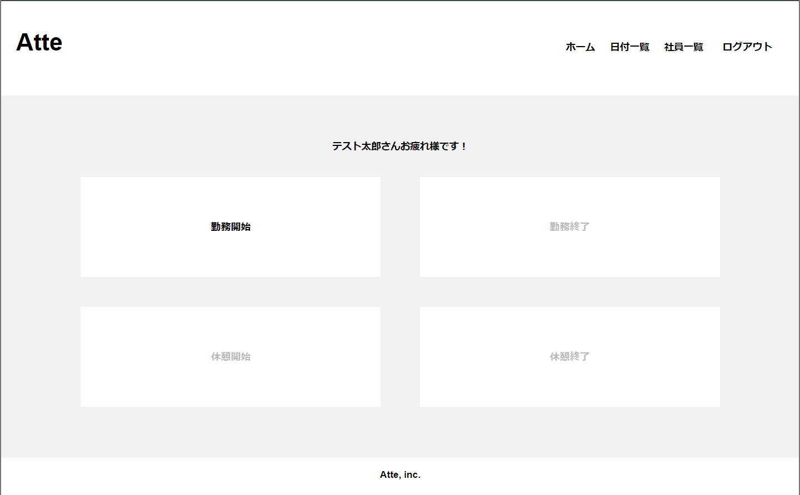
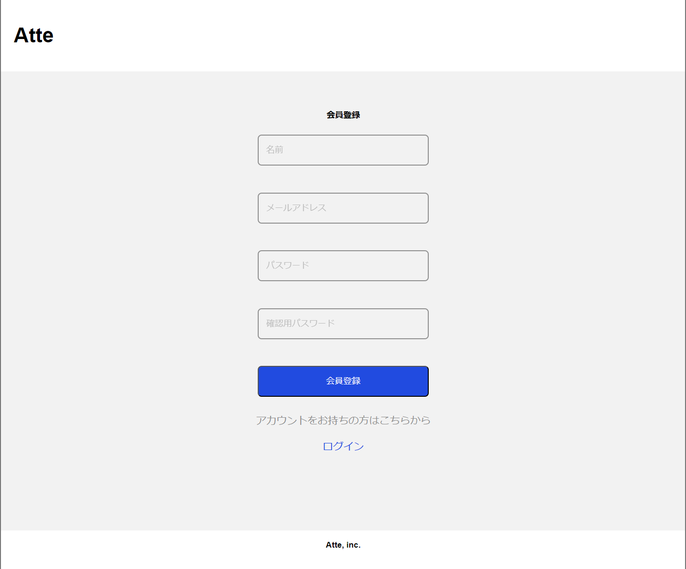
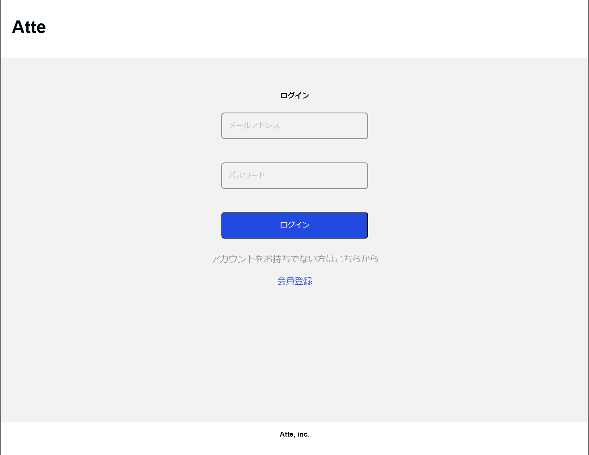
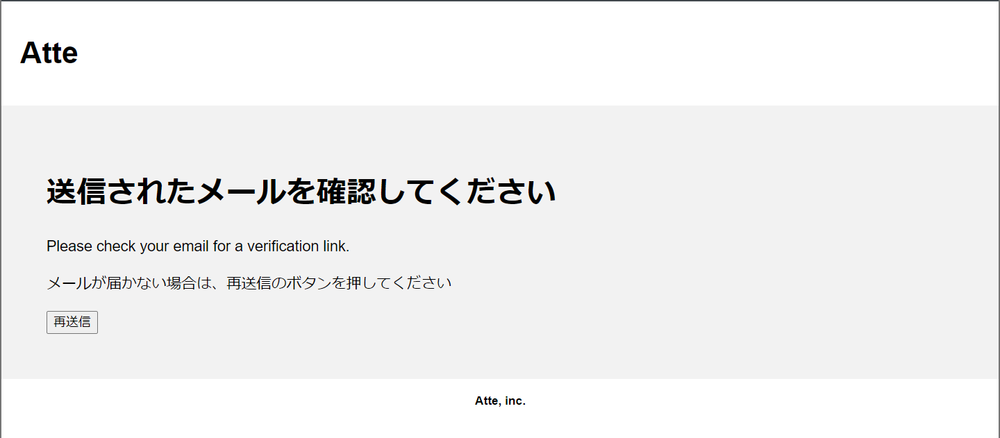
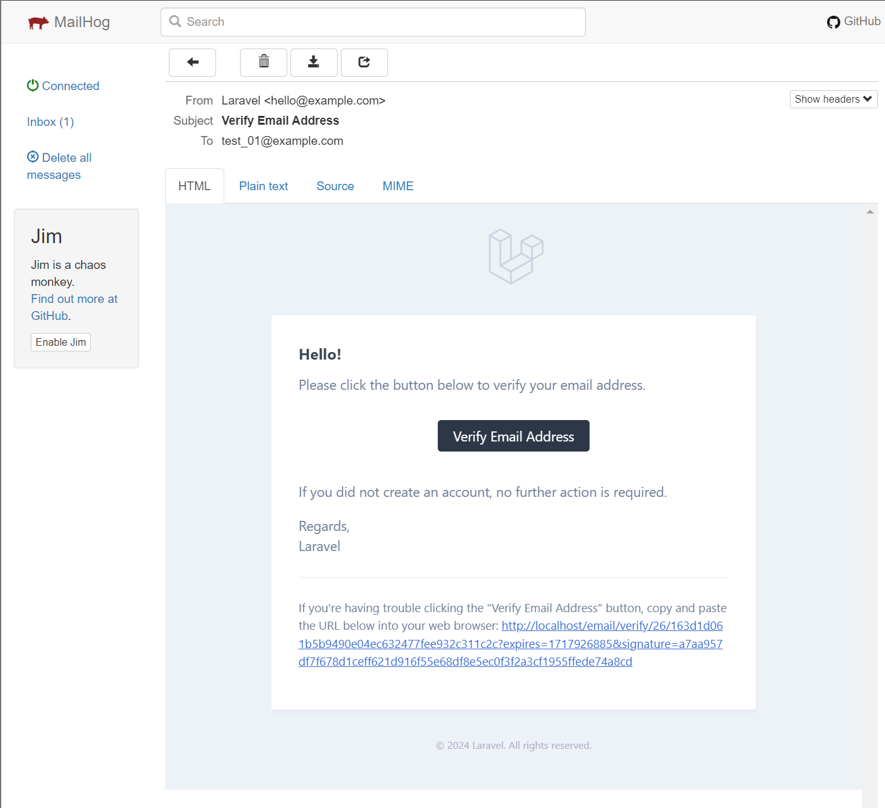
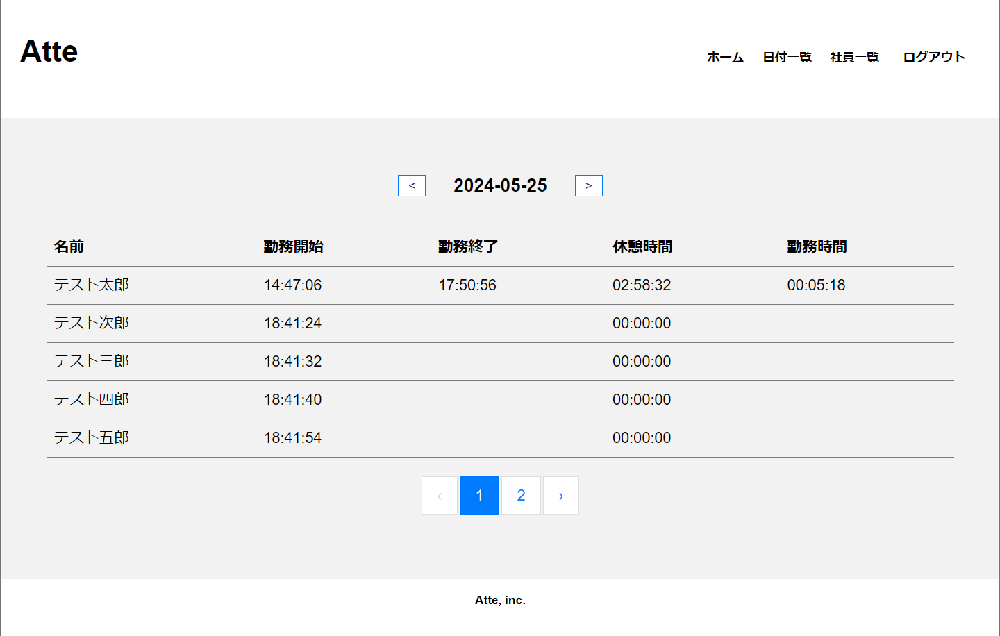

# Atte（アット）

## 概要
株式会社○○の社員勤怠管理システム   


## 作成した目的
社員の勤怠情報を管理し、人事評価のために活用する

## アプリケーションURL
[URL]  
※会員登録の際のメール認証はMailHog(以下のURL)にて実行してください。  
MailHog：[URL]  
※メール認証に使用するメールアドレスは以下のドメイン形式にて実施してください。  
「~@example.com」  
※EC2インスタンスとRDSのDBは提出から1週間後の6月16日22:00に停止をします。その日以降に採点を行う際は齋藤コーチまたは菅野にお声がけください。  

## 機能一覧
| 会員登録ページ |　ログインページ |
| ---- | ---- |
|  |  |
| 氏名・メールアドレス・確認用メールアドレス・パスワードを入力してログインユーザーを作成します。  | 登録したメールアドレスとパスワードで打刻ページに遷移する認証機能を実装しました。 |

| 本人確認画面 |　本人確認メール |
| ---- | ---- |
|  |  |
| 会員登録した際に本人確認を行う認証機能を実装しました。  | 会員登録した際に本人確認を行う認証機能を実装しました。(メール本文) |

| ☆打刻ページ |　☆日付別勤怠ページ |
| ---- | ---- |
|  |  |
| 勤怠管理をするために、勤務開始・勤務終了・休憩開始・休憩終了の時刻を登録する機能を実装しました。  | 日付ごとにユーザーの勤怠情報を表示する機能を実装しました。 |

| ☆社員一覧ページ |　☆勤怠情報ページ |
| ---- | ---- |
|  |  |
| 勤怠管理をするために、勤務開始・勤務終了・休憩開始・休憩終了の時刻を登録する機能を実装しました。  | 日付ごとにユーザーの勤怠情報を表示する機能を実装しました。 |
 

【☆社員一覧ページ】  
[画像]  
登録されているユーザー(社員)の一覧表示機能と、ユーザーごとの勤怠情報を表示するリンクを実装しました。  

【☆勤怠情報ページ】  
[画像]  
ユーザーごとの勤怠情報表示機能を実装しました。  

【☆(共通ヘッダー)】  
ホーム：打刻ページに遷移します。  
日付一覧：日付別勤怠ページに遷移します。  
社員一覧：社員一覧ページに遷移します。  
ログアウト：ログインしたユーザーのログアウト機能を実装しました。ログアウト後はログインページに遷移します。  

## 使用技術(実行環境)
- PHP8.3.0  
- Laravel8.83.27  
- MySQL8.0.26  

## テーブル設計
[画像]

## ER図
[画像]

## 環境構築
**Dockerビルド**
1. `git clone git@github.com:shkb1125/attendance_record.git`  
2. DockerDesktopアプリを立ち上げる
3. `docker-compose up -d --build`

> *MacのM1・M2チップのPCの場合、`no matching manifest for linux/arm64/v8 in the manifest list entries`のメッセージが表示されビルドができないことがあります。
エラーが発生する場合は、docker-compose.ymlファイルの「mysql」内に「platform」の項目を追加で記載してください*
``` bash
mysql:
    platform: linux/x86_64(この文追加)
    image: mysql:8.0.26
    environment:
```
**Laravel環境構築**
1. `docker-compose exec php bash`
2. `composer install`
3. 「.env.example」ファイルを 「.env」ファイルに命名を変更。または、新しく.envファイルを作成
4. .envに以下の環境変数を追加
``` text
DB_CONNECTION=mysql
DB_HOST=mysql
DB_PORT=3306
DB_DATABASE=laravel_db
DB_USERNAME=laravel_user
DB_PASSWORD=laravel_pass
```
5. アプリケーションキーの作成
``` bash
php artisan key:generate
```

6. マイグレーションの実行
``` bash
php artisan migrate
```
**MailHog環境構築**
1. MailHogのインストール
``` bash
brew install mailhog
mailhog
```
2. .envに以下の環境変数を追加
``` text
MAIL_MAILER=smtp
MAIL_HOST=mailhog
MAIL_PORT=1025
MAIL_USERNAME=null
MAIL_PASSWORD=null
MAIL_ENCRYPTION=null
MAIL_FROM_ADDRESS="hello@example.com"
MAIL_FROM_NAME="${APP_NAME}"
```
3. src/app/config配下のmail.phpに以下の環境変数を追加
``` text
    'mailers' => [
        'smtp' => [
            'transport' => 'smtp',
            'host' => env('MAIL_HOST', 'mailhog'),
            'port' => env('MAIL_PORT', 1025),
            'encryption' => env('MAIL_ENCRYPTION', null),
            'username' => env('MAIL_USERNAME', null),
            'password' => env('MAIL_PASSWORD', null),
            'timeout' => null,
            'auth_mode' => null,
        ],
	~~以下略~~
    ],
```
4. docker-compose.ymlファイルにMailHogのサービスを追加
``` text
mailhog:
   image: mailhog/mailhog
   ports:
     - "8025:8025"
     - "1025:1025"
```
5. コンテナの再起動
起動している場合
``` bash
docker-compose up stop
docker-compose up -d
```
停止している場合
``` bash
docker-compose up -d
```
6. キャッシュクリア(設定が反映されない場合)
``` bash
docker-compose exec app php artisan config:cache
docker-compose exec app php artisan config:clear
```

## テストユーザー作成の注意事項
メール認証に使用するメールアドレスは以下のドメイン形式にて実施してください。  
「~@example.com」

## URL
- 開発環境：http://localhost/
- phpMyAdmin:：http://localhost:8080/
- MailHog：http://localhost:8025/
